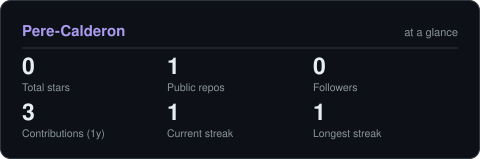

<!-- BANNER - terminal profile.sh --live. Generated by scripts/banner/generate.py
     from assets/source/portrait.png. Cache-bust with ?v=N after regenerating. -->
<picture>
  <source media="(prefers-color-scheme: dark)"  srcset="assets/banner-dark.v1.svg">
  <source media="(prefers-color-scheme: light)" srcset="assets/banner-light.v1.svg">
  
</picture>

 

<!-- NAME / TAGLINE - animated typing -->

 

<!-- SOCIALS - LinkedIn stays brand blue (glyph vanishes on custom fills). Others themed. -->
&nbsp;&nbsp;
&nbsp;&nbsp;

 

---

## This is me :)

Hi, I'm **Pere**, a 21-year-old software engineer from Blanes, Catalonia 🇪🇸.
I just finished my Computer Engineering degree and I'm looking for my first real
opportunity to grow as an engineer, ideally somewhere I can build things with AI.

- 🎓 **Computer Engineering graduate** at the Universitat de Girona (2022 – 2026). Final project: a gym app with a conversational assistant built on React Native, NestJS, PostgreSQL and Azure OpenAI with function calling.
- 🤖 **Backend + applied AI** is where I want to be: RAG pipelines, LLM integrations with function calling, embeddings and vector search. During my internship at **cdmon** I built a document-ingestion RAG pipeline (DeepSeek-OCR → BGE-M3 embeddings → pgvector on FastAPI) and an image-to-SVG vectorization engine with a React/TypeScript frontend.
- 🧠 I like understanding how things work under the hood, writing clear and efficient code, and taking a feature from idea all the way to production.
- 🚀 **Looking for:** a junior role in backend / AI engineering where I can learn from a strong team and ship real things.
- 🏋️ Away from the keyboard: gym, volleyball and boxing.
- 💬 Talk to me about **LLM apps, RAG and system architecture** and you'll have my full attention. I speak Catalan, Spanish and English.
 

## my stack

---

## signals

<table>
<tr>
<td width="50%" align="center" valign="middle">

<!-- Self-rated radar - edit assets/skills.json, the workflow redraws it -->
<picture>
  <source media="(prefers-color-scheme: dark)"  srcset="assets/radar-dark.svg">
  <source media="(prefers-color-scheme: light)" srcset="assets/radar-light.svg">
  
</picture>

</td>
<td width="50%" align="center" valign="middle">

<!-- Hand-authored language radar - edit assets/langmix.json -->
<picture>
  <source media="(prefers-color-scheme: dark)"  srcset="assets/radar-langs-dark.svg">
  <source media="(prefers-color-scheme: light)" srcset="assets/radar-langs-light.svg">
  
</picture>

</td>
</tr>
</table>

---

## Numbers matter? ohhh yes.

<!-- Generated by scripts/cards.py into this repo. Deliberately NOT
     github-readme-stats / streak-stats / github-profile-trophy: those are
     shared public instances that go down and take the whole section with them. -->
<picture>
  <source media="(prefers-color-scheme: dark)"  srcset="assets/card-stats-dark.svg">
  <source media="(prefers-color-scheme: light)" srcset="assets/card-stats-light.svg">
  
</picture>

 

---

` Built with love · @Pere-Calderon `

